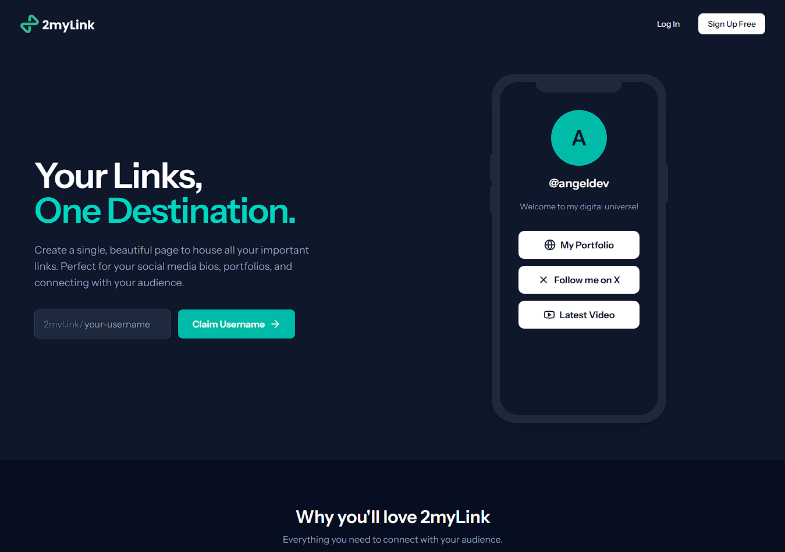

# 2mylink - Your Open-Source Linktree Alternative

[](https://opensource.org/licenses/MIT)
[](http://makeapullrequest.com)

**2mylink** is a powerful, open-source, and self-hostable alternative to services like Linktree. It allows you to create a personalized and easily customizable page that houses all the important links you want to share. Built with a modern tech stack, it provides a robust platform for creators, influencers, and businesses.

### ✨ **[Live Demo](https://2myl.ink/)** ✨

---

## Features

-   **🔗 Link Management:** Easily create, edit, and organize your links.
-   **➖ Dividers:** Add dividers to visually structure and group your links.
-   **👤 User Accounts:** Simple registration and account management system.
-   **🔐 Google Authentication:** Allow users to sign up and log in with their Google account for a seamless experience.
-   **👑 Admin Dashboard:** A comprehensive admin view to manage users, themes, and site settings.
-   **🎨 Public Profile Customization:**
    -   **Theme Selection:** Choose from a variety of pre-made themes to style your public page.
    -   **Premium Themes:** Offer exclusive, premium themes for subscribers.
-   **📱 QR Code Generation:** Instantly generate a QR code that points to your public profile, perfect for offline sharing.
-   **🔧 Theme Management:** Admins can create, update, and manage the availability of themes (both free and premium).
-   **💳 Subscription Management:**
    -   **Stripe Integration:** Securely handle payments and subscriptions using Stripe.
    -   Users can subscribe to premium plans to unlock special features like exclusive themes.
-   **Responsive Design:** A fully responsive and mobile-first interface that looks great on any device.

---

## Technologies Used

This project is built with a modern and powerful technology stack:

-   **Backend:** **[Laravel](https://laravel.com/)**
-   **Frontend:** **[React](https://reactjs.org/)** with **[Inertia.js](https://inertiajs.com/)**
-   **Database:** Compatible with MySQL, PostgreSQL, etc.
-   **Payments:** **[Stripe](https://stripe.com/)** for secure payment and subscription processing.

---

### 📸 Screenshots Gallery

<table align="center">
  <tr>
    <td align="center" valign="top">
      <strong>Landing Page</strong><br><br>
      
    </td>
    <td align="center" valign="top">
      <strong>Public Profile</strong><br><br>
      
    </td>
  </tr>
  <tr>
    <td align="center" valign="top">
      <strong>Dashboard</strong><br><br>
      
    </td>
    <td align="center" valign="top">
      <strong>Theme Selection</strong><br><br>
      
    </td>
  </tr>
</table>

---

## Getting Started

To get a local copy up and running with Docker, follow these simple steps.

### Prerequisites

Make sure you have the following installed on your system:
-   **Docker Desktop** (includes Docker and Docker Compose)
-   **Git**

### Installation with Docker

1.  **Clone the repository**
    ```sh
    git clone https://github.com/angel-gmz/2mylink.git
    cd 2mylink
    ```

2.  **Set up your environment file**
    -   Copy the example `.env` file.
    ```sh
    cp .env.example .env
    ```
    -   Generate your application key.
    ```sh
    docker compose run --rm app php artisan key:generate
    ```

3.  **Configure your `.env` file**
    -   The database configuration is already set for Docker (no changes needed for local development)
    -   Add your Stripe API keys (`STRIPE_KEY`, `STRIPE_SECRET`)
    -   Add your Google Client ID and Secret for social authentication
    -   The `APP_URL` is set to `http://localhost:8080`

4.  **Build and start the Docker containers**
    ```sh
    docker compose up -d
    ```
    This will start three containers:
    - `2mylink_app` - Laravel application (PHP-FPM)
    - `2mylink_nginx` - Web server
    - `2mylink_postgres` - PostgreSQL database

5.  **Run database migrations**
    ```sh
    docker compose exec app php artisan migrate
    ```
    Or use the helper script (Windows):
    ```sh
    .\artisan.ps1 migrate
    ```

6.  **Access your application**
    
    Your local instance should now be running at **`http://localhost:8080`**

### Using Artisan Commands

You can run Artisan commands in two ways:

**Option 1: Using Docker Compose directly**
```sh
docker compose exec app php artisan [command]
```

**Option 2: Using helper scripts (Windows)**

PowerShell (recommended):
```sh
.\artisan.ps1 [command]
.\composer.ps1 [command]
.\npm.ps1 [command]
```

Command Prompt (cmd):
```sh
.\artisan.bat [command]
.\composer.bat [command]
.\npm.bat [command]
```

Examples:
```sh
# Run migrations
.\artisan.ps1 migrate

# Create a new migration
.\artisan.ps1 make:migration create_example_table

# Run seeders
.\artisan.ps1 db:seed

# Clear cache
.\artisan.ps1 cache:clear

# Install a package
.\composer.ps1 require vendor/package

# Install npm dependencies
.\npm.ps1 install
```

### Stopping the Application

```sh
docker compose down
```

To stop and remove all data (including database):
```sh
docker compose down -v
```

---

## Traditional Installation (Without Docker)

If you prefer not to use Docker:

1.  **Prerequisites**: PHP 8.2+, Composer, Node.js, PostgreSQL
2.  **Install dependencies**: `composer install && npm install && npm run build`
3.  **Configure `.env`**: Update database credentials for your local PostgreSQL
4.  **Run migrations**: `php artisan migrate`
5.  **Start server**: `php artisan serve`

---

## Contributing

Contributions are what make the open-source community such an amazing place to learn, inspire, and create. Any contributions you make are **greatly appreciated**.

If you have a suggestion that would make this better, please fork the repo and create a pull request. You can also simply open an issue with the tag "enhancement".

1.  **Fork the Project**
2.  **Create your Feature Branch** (`git checkout -b feature/AmazingFeature`)
3.  **Commit your Changes** (`git commit -m 'Add some AmazingFeature'`)
4.  **Push to the Branch** (`git push origin feature/AmazingFeature`)
5.  **Open a Pull Request**

Please make sure your code follows the project's coding standards and includes tests where applicable.

---

## License

Distributed under the MIT License. See `LICENSE.md` for more information.

---

## Contact

Angel Gómez - [@angel-gmz](https://www.linkedin.com/in/angel-gmz) - angel-gomez@hotmail.com

Project Link: [https://github.com/angel-gmz/2mylink](https://github.com/angel-gmz/2mylink)
